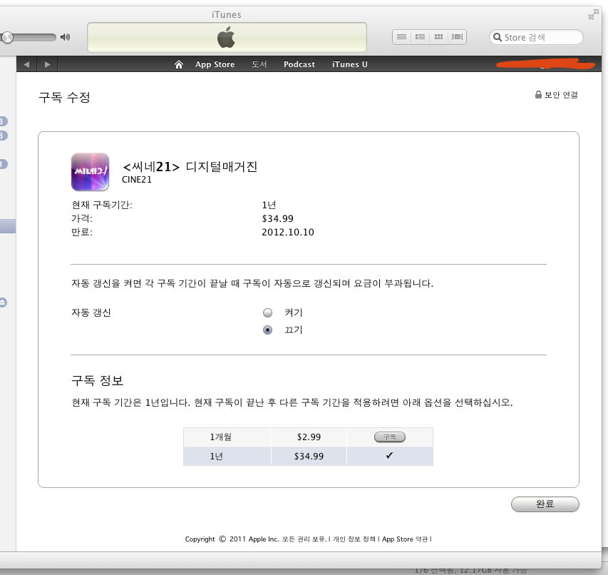

[씨네21](http://cine21.com/)의 [아이패드 앱](http://itunes.apple.com/kr/app/cine21/id432809312?mt=8) 이 있는 건 다들 아시죠? 매호 가격은 $0.99 입니다. 원으로 계산해보면 오늘 기준으로 1,157원이네요. 서점이나 가판에서 사면 3천원입니다. 절반도 안되는 가격이죠.

<!-- truncate -->

말도 안되는 가격입니다. 읽는 재미를 침범하지 않을 정도의 적당한 인터렉션에 적당한 동영상들이 들어있는데 가격이 절반 이하라니요. 아, 물론 책으로 보관하는 재미를 느낄 수는 없죠. 용량이 넘어가면 삭제도 해야하고요. 단, 삭제했다가 다시 다운로드를 받아도 추가 요금이 발생하지는 않아요. 조금 불편할 뿐이죠.

게다가 저는 가볍게 읽는 편이고, 자료 조사를 위해서 과월호를 자주 다시 찾아보고 꺼내보는 편이 아니기 때문에 용량 때문에 삭제를 해야 하는 게 큰 불편으로 느껴지지 않습니다.

이런 씨네21 아이패드 앱이 이번에 업데이트 되면서 정기구독 기능이 생겼습니다. 1달에 $2.99, 1년에 $34.99. 계산해보면 1달에 대략 3천5백원, 1년에 4만5백원입니다.

<blockquote>
**한달 정기구독할 경우**

(종이잡지) 3천원 x 4회 = 1만2천원
(아이패드) 1달 정기구독 3천5백원

3천5백원 / 1만2천원 = 약 29%

**1년 정기구독할 경우**

(종이잡지) [1년 정기구독료 15만원](http://www.magazine21.co.kr/cine21/help.jsp)
(아이패드) 1년 정기구독료 4만5백원

4만5백원 / 15만원 = 27%
</blockquote>

실로 엄청난 할인율이죠. 1/3이 안되는 가격으로 씨네21을 볼 수 있습니다. 과연 이 가격으로 뭐가 남나... 아니 과연 망하지 않고 오래 만들 수나 있나 싶을 정도의 가격입니다. (물론 종이잡지를 정기구독하면 영화표나 단행본 등 추가 상품 혜택이 있긴 합니다)

어쨌든 이런 놀라운 가격 혜택에 힘입어 저는 아이패드용으로 1년 정기구독을 했습니다. 씨네21 자주 보시는 분들이라면 충분히 지를만한 조건이고요, 거의 매주 보시는 분이라면 무조건 질러야 하는 조건입니다.

* * *

아이패드 버전으로의 정기구독은 구독기간이 넘어가면 자동으로 갱신이 되는 형태로 되어 있습니다.

만약 자동으로 갱신이 되는 걸 원치 않으면 아이튠즈를 실행시켜서 Store 메뉴에서 나의 계정 보기를 선택하면 하단의 설정 카테고리에 구독 항목이 있습니다. 여기서 관리를 선택해서 조정하실 수 있습니다.

*자동 갱신이 원래 켜져있는데 위처럼 끌 수 있어요*

* * *

참고로 올해 6월 28, 29일에 타임지과 씨네21의 아이패드 출판과 운영에 대한 세미나 [씨네21과 타임은 아이패드에서 어떻게 재탄생 했나](http://onoffmix.com/event/3177) 있었다고 하더군요.

[남반장님](http://funnyplan.com/) 이 그 때의 기록을 잘 [정리](http://funnyplan.com/blog/2011/06/30/how-to-rebuild-ipad-magazine-time-and-cine21/) 해두셨더군요. 잘 읽었습니다. :-)

**링크**

- [funnyplan.com - 씨네21과 Time은 아이패드 iPad에서 어떻게 재탄생 했나?](http://funnyplan.com/blog/2011/06/30/how-to-rebuild-ipad-magazine-time-and-cine21/)
- [funnyplan.com - 씨네21과 Time은 아이패드 iPad에서 어떻게 재탄생 했나? (pdf 버전)](http://dl.dropbox.com/u/5522493/how-to-rebuild-ipad-magazine-time-and-cine21_20110628.pdf)