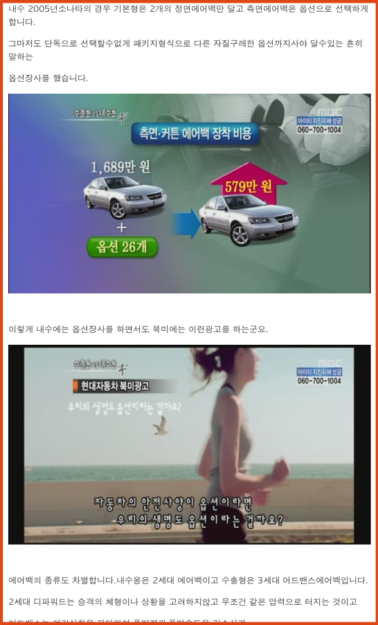

나경원최고위원이 '역수입 국산차'를 소유하고 있다는 사실이 밝혀졌다.

<!-- truncate -->

현대차 관계자는 27일, 나경원 최고위원이 소유한 '아제라' 승용차는 국내서 판매되지 않으며 해외에서만 판매되는 모델이라고 밝혔다. 이 차는 북미, 중국 및 동남아, 중동 지역에서만 구입할 수 있으며 개인이 이를 수입해 온 것이라고 했다.   
  
(중략)  
  
한국산 자동차를 역수입 했을때 면제되는 부분은 관세, 특소세, 교육세, 부가세 등 차량 가격의 30%에 달하는 세금 등이다.  
  
(중략)  
  
당시 서울 세관의 한 관계자는 "국산차는 국내에서 사는 것 보다 해외에서 수입해 오는 것이 훨씬 이득"이라면서 "가능한 사람이라면 누구나 수입해온다"고 말했다.  
  
출처 : [보이는 자동차 미디어, 탑라이더 - 나경원 최고위원, 역수입 국산차 '아제라' 어떻게?](http://www.top-rider.com/news/articleView.html?idxno=7125 "[http://www.top-rider.com/news/articleView.html?idxno=7125]로 이동합니다.")

위의 기사를 보니 비슷한 시기에 같은 차를 수입해 온 사람의 이야기에 의하면 국내 차보다 1,500만원 이상 저렴했다고 합니다.  
  
조금 지난 기사였던 위 기사를 보니 2010년 2월 4일 MBC [<후 플러스>](http://www.imbc.com/broad/tv/culture/newswho/vod/ "[http://www.imbc.com/broad/tv/culture/newswho/vod/]로 이동합니다.")에서 방송되었던 "수출용 vs 내수용"이라는 방영분이 떠올랐습니다.

Knee bolster, 있다? 없다?  
내수용 차에는 없는 것이 수출용 차에는 있다? <후플러스> 취재진은 똑같은 모델의

현대차를 내수용과 수출용, 두 대를 입수해 자동차 전문가와 함께 전격 분해했다.

그 결과, 실제로 내수용과 수출용 차량에는 분명한 차이가 있었다. 왜! 내수용 차량

에는 없는 것이 수출용에는 있을까? 그 이유를 현대차에 물었다.   
  
 안전장치가 옵션이라면, 우리의 생명도 옵션?  
최근 자동차 메이커들은 사고를 미연에 예방할 수 있는 최첨단 안전장치 시스템을지향하고 있다. 스스로 위험을 감지해 브레이크 제동을 걸거나, 후방 주차시 모니터로 주차 상황을 볼 수 있는 시스템 등이 그 예이다. 미국은 주행시 미끄러움을 위해사고를 줄일 수 있는 ESC(차량자세제어장치)나 TPMS(타이어공기압감지시스템)같은 안전장치를 기본 사양으로 장착해 안전성을 더욱 높이고 있다. 하지만 취재 결과, 국내 사정은 달랐다. 영업소 판매원들은 안전장치가 큰 도움이 되지 않는다며 권하지 않거나, 실제로 장착을 하고 싶어도 최고급 사양에서만 선택할 수 있는 등 안전장치를 장착하기까지는 쉽지 않았다.

  
출처 : [MBC <후 플러스> 150회 - 수출용 vs 내수용](http://www.imbc.com/broad/tv/culture/newswho/vod/?kind=image&progCode=1000844100156100000&pagesize=5&pagenum=1&cornerFlag=0&ContentTypeID=1&ProgramGroupID=0 "[http://www.imbc.com/broad/tv/culture/newswho/vod/?kind=image&progCode=1000844100156100000&pagesize=5&pagenum=1&cornerFlag=0&ContentTypeID=1&ProgramGroupID=0]로 이동합니다.") (무료 다시보기 VOD 포함)

  
만약 볼 시간이 없는 분들은 [케빈은아직도12살님이](http://www.hankyung.com/board/view.php?id=hyundai&no=10804&ch=auto "[http://www.hankyung.com/board/view.php?id=hyundai&no=10804&ch=auto]로 이동합니다.")[위의 방송을](http://www.hankyung.com/board/view.php?id=hyundai&no=10804&ch=auto "[http://www.hankyung.com/board/view.php?id=hyundai&no=10804&ch=auto]로 이동합니다.")[캡쳐](http://www.hankyung.com/board/view.php?id=hyundai&no=10804&ch=auto "[http://www.hankyung.com/board/view.php?id=hyundai&no=10804&ch=auto]로 이동합니다.")한 것을 봐도 내용을 확인하실 수 있습니다.  
  

  
  
  

\* \* \*

  
  
국회의원은 여기저기서 정보도 많이 얻고 권력도 있으니 원하기만 하면 할 수 있는 일들이 평범한 사람들보다는 조금 더 많겠죠. 하지만 그렇다고 그런 점들을 사적으로 이용하면 공인이라 할 수 없겠죠.  
  
또한
