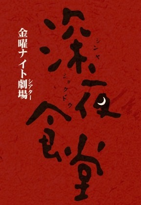

<iframe width="100%" height="315" src="https://www.youtube.com/embed/k7Xs4QK5QIs?si=mJ5-FK1E6Rd-6bdj" title="YouTube video player" frameborder="0" allow="accelerometer; autoplay; clipboard-write; encrypted-media; gyroscope; picture-in-picture; web-share" referrerpolicy="strict-origin-when-cross-origin" allowfullscreen></iframe>*福原希己江 - できること (live, 2011년 5월 21일, 장소 : 草枕(西新橋))*

<!-- truncate -->



저는 일본 드라마 &lt;심야식당>의 팬입니다. 신주쿠 근처의 어느 골목에서 한 요리사가 혼자 한 식당을 자정부터 새벽까지 운영하는데 특이하게도 손님이 원하는 모든 음식을 만들어주죠. TBC에서 제작한 이 드라마는 원래 만화가 원작입니다.

한 편에 35분 내외, 총 10편으로 이루어진 &lt;심야식당> (1기, 2009년)은 소박한 분위기와 여러 인물들의 다양한 이야기들이 담담하게 그려지죠. 맛을 내기 위해 억지로 자극적인 기술을 구사하거나 과한 조미료를 넣거나 하지 않습니다.

그런 &lt;심야식당>의 2기가 시작되었습니다. 첫 번째 에피소드는 "다시 빨간 비엔나 소세지"인데, 1기의 첫 번째 에피소드인 "비엔나 소세지와 계란말이"의 이야기에서 다 밝히지 않은 이야기를 이어갑니다.

내용은 드라마를 직접 보시면 아실테고, 2기의 첫 번째 에피소드 후반부에 삽입된 노래가 아아- 참 좋더군요.

노래를 부른 가수는 후쿠하라 키미에 (福原希己江, Fukuhara Kimie)라고 하는데 [조그만 카페에서 라이브](https://2gwang2.blog.me/100135465457) 를 했다거나 [마이 스페이스에 올라온 몇몇 곡들](https://www.myspace.com/fukuharakimie) 정도는 찾았는데, 일본어를 못해서 앨범을 냈는지 어떤지 그런 것들은 알지 못합니다. 아, 1979년 하네다에서 태어났대요.

```
할 수 있는 일

by 福原希己江

추억을 잊고 싶다면
자, 내가 지우개로 지워줄게요
안심하고 주무세요

얼어붙을 듯 추운 아침도 떨리는 대지도
몸에 새겨진 기억이
당신을 강하게 만드는 거겠죠

이윽고 흙에 돌아갈 거라는 걸 알아도
이 마음을 어떻게 하면,
어떻게 하면 좋을까

내 노래는 아무런 힘도 없지만
당신의 마음을
조금이나마 위로할 정도는 될 거예요

추억을 잊고 싶다면
자, 내가 지우개로 지워줄게요
안심하고 주무세요
```