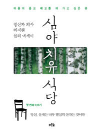
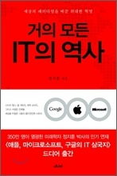

**#1 한독약품 훼스탈 플러스 광고**

작년에 한독약품에서 나온 소화제 광고를 보고 뜨악한 적이 있었습니다. 제가 좋아하는 드라마 &lt;심야식당>을 그대로 베껴놓았더군요.

<!-- truncate -->

<iframe width="100%" height="315" src="https://www.youtube.com/embed/yOhPaDzF0hA?si=MEiBQHfsQ2oX-X2o" title="YouTube video player" frameborder="0" allow="accelerometer; autoplay; clipboard-write; encrypted-media; gyroscope; picture-in-picture; web-share" referrerpolicy="strict-origin-when-cross-origin" allowfullscreen></iframe>*훼스탈 플러스 광고 \(노골적인 심야식당 표절 아닌가요?)*

드라마 &lt;심야식당> 측으로부터 허락을 받았다든지, 아니면 라이센스를 구했다든지 하면 문제가 없겠지만 아무리 찾아봐도 인터넷에는 그랬다는 정보는 없더군요. 상당히 노골적인 표절이었다고 생각합니다.

게다가 이게 더욱 코미디인 건 한독약품은 ["김갑수와 함께하는 훼스탈® 심야식당"](https://www.newswire.co.kr/newsRead.php?no=510111&lmv=A01) 이라는 이벤트를 열기도 했고, 한국광고주협회와 문화체육관광부가 공동 주최하는 ['제19회 소비자가 뽑은 좋은 광고상'에서 수상](https://www.medisobizanews.com/news/articleView.html?idxno=8061) 을 했다는 것이지요.

**#2 책 제목 "심야 치유 식당"**

책은 보지 않아서 내용은 모릅니다만, [책 소개](http://www.aladin.co.kr/shop/wproduct.aspx?ISBN=8971848545) 를 보니 정신과 전문의 하지현이 쓴 에세이집이라는데 한 정신과 의사가 대학가 뒷골목에 '노사이드'라는 바를 차려서 손님들에게 조언을 한다는 내용이래요.

그런데, 심야식당이 무슨 고유명사도 아니고, 책 속에서도 식당이 아니라 바를 차렸다면서 책 제목은 심야 치유 식당, 게다가 책 표지를 보니 '심야'와 '식당'을 의도적으로 한 톤으로 눈에 띄게 해놓았더군요.

누가 책 제목을 짓고 기획을 했는지 모르겠지만 참 우습다 싶었습니다.

**#3 책 제목 "거의 모든 IT의 역사"**

\(아, 이건 심야식당과는 관련이 없지만 책 제목을 보자마자 기억에 남았던 책이라)

제가 알기로 2003년 빌 브라이슨이 쓴 [거의 모든 것의 역사 (A Short History of Nearly Everything](http://www.aladin.co.kr/shop/wproduct.aspx?ISBN=8972913642) 는 국내에서도 상당히 히트한 책입니다. 책 제목은 '거의 모든 것의 역사'이지만 사실은 과학 위주의 내용을 담고 있기 때문인지 올해는 &lt;거의 모든 사생활의 역사 (At Home : A Short History of Private Life)> 라는 책이 나오기도 했죠.

작년에 &lt;거의 모든 IT의 역사>라는 책이 나왔길래 빌 브라이슨이 뭔가 다른 책을 썼나 하고 유심히 보니 우리나라 저자가 쓴 책이더군요. 책 제목이 하도 비슷해서 그리고 시리즈처럼 보여서 뭔가 빌 브라이슨과 연관성이 있는 책인가 싶어 한참을 찾아본 기억이 납니다. 그런데, 전혀 그렇지 않더군요. 이 책도 거의 모든 IT의 역사라고는 하지만 MS, 구글, 애플 위주의 이야기가 내용의 거의 전부입니다.

이 책을 기획하거나 직접 쓴 분이 빌 브라이슨의 책을 모를리 없을텐데 저처럼 **"저 제목은 짝퉁이야"** 라고 생각할 사람들이 많을 것임에도 불구하고 왜 저런 제목을 달았을까 궁금하더군요.

**## 그리고**

참, 이 책 때문에 인터넷 서점에서 검색을 해보니 빌 브라이슨의 책 이후로 "거의 모든 ~~의 OO" 으로 제목이 번안되거나 쓰여진 책들이 종종 있더군요. 아래는 잠깐 찾아본 책 제목들입니다.

- 거의 모든 것의 미래
- M-everything 미디어 혁신에 관한 거의 모든 시선
- 거의 모든 죽음의 역사
- 거의 모든 사람들을 위한 과학
- 농업, 거의 모든 것의 역사
- 거의 모든 스파이의 역사

위의 책들은 모두 2003년 이후에 출간된 책들이고 이 책들 중 원제가 영어인 것들 중 nearly everything 이라는 말이 들어간 책은 하나도 없더군요. 그런데, 참 유용한 표현인 것 같긴 해요. "거의 모든 것의 역사"라니... 언급이 안된 것에 대해서는 "내가 볼 때 별로 중요하지 않아서 빼놓았다" 혹은 "내가 언제 '모든 것'의 역사"라고 그랬느냐" 라고 핑계를 대면 될테니까요. :-p