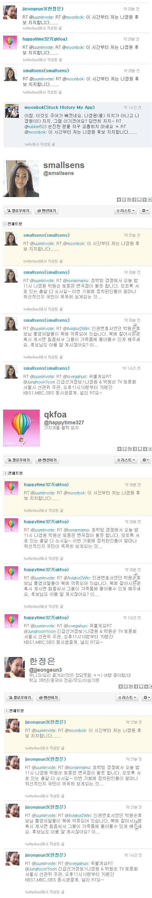
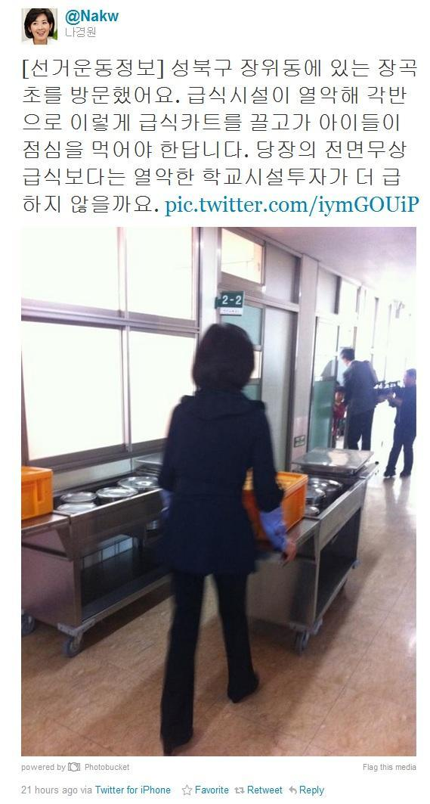
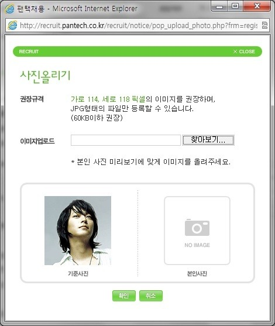

역시 지난 주 제가 날린 트윗들 중 리트윗 받은 글들만.

<!-- truncate -->

<blockquote>
  2011-10-23

  원래 사이트는 디어 포토그래피 [dearphotograph.com](https://dearphotograph.com) RT @sungchi: 과거를 보는 창, 사진 [bit.ly/rtGDhf](https://bit.ly/rtGDhf)

  = 멋진 기획에 멋진 참여자들이 만드는 과거와 현재, 비주얼과 스토리들.
</blockquote>

* * *

<blockquote>
  **2011-10-22**

  **이번 선거는 '아름다운 재단과 아름다운 피부'의 대결 혹은 '기부냐 피부냐'의 대결이다.**

  = 슬픈 건 이번에도 역시 정책과는 전혀 관계없는 이슈들로 중요한 선거가 치뤄지고 있다는 것.
</blockquote>

* * *

<blockquote>
  2011-10-22

  급식시설이 열악하니까 급식카트 사용한다? [twitpic.com/73dp6r](https://twitpic.com/73dp6r) 정말 이해할 수 없는 마인드. 전국 학교에 급식실 건설 핑계 토건 마인드 발동?

  

  = 잘 사는 동네도 급식카트 사용하는 학교들 많고, 급식 카트를 사용하는 학교에서도 그걸 싫어라 하지 않는 학생들이 많다. 내가 보기엔 아무리 생각해도 반대를 위한 반대. 토건을 위한 반대.
</blockquote>

* * *

<blockquote>
  2011-10-20

  트윗피드로 증식되는 주어없는 그녀 트윗의 RT들 [twitpic.com/732th7](https://twitpic.com/732th7) 대놓고 트윗피드로 숫자 늘리는 걸 보면 쟤네는 앞으로도 안변하겠구나 싶다; 얼굴도 초상권 안따지고 그냥 갖다 쓴 거 같은데;

  

  = twitterfeed 를 사용해서 복제를 하다니... 정말 할 말이 없을 따름이다.
</blockquote>

* * *

<blockquote>
  2011-10-20

  누구는 딸이 왕따를 당해서 위장전입, 누구는 딸 치료차 1억짜리 피부관리... 정치인들의 자식이 무슨 죄가 있냐;;;

  = 저런 정치인들 집에서 부모와 자식이 어떤 대화를 하는지 정말 궁금하다.
</blockquote>

* * *

<blockquote>
  2011-10-20

  다이아는 20년 전에 받아서 20년 전 가격으로 신고; RT @so_picky: 수수료는 직원 통장으로 받고 피부 클리닉은 실비 수준으로 했고 ... 나경원 씨 참 어렵게 살아오셨네

  = 20년 전에 다이아반지를 받았으니 20년 전 가격으로 300만원이라고 우기면, 그럼 30년 전에 지은 집이었다면 100만원으로 신고할 거냐?
</blockquote>

* * *

<blockquote>
  2011-10-20

  (조선일보) 소망교회 목사 폭행 부목사들 집행유예 [https://t.co/KWkNss2h](https://t.co/KWkNss2h) "징역형을 받으면 앞으로 목사일을 하는데 흠이 될수 있는 점을 참작해 집행유예를 선고" 목사라는 직업은 천하무적

  = 목사하면 징역 면제; 할렐루야. 판사가 뭐 저따위야.
</blockquote>

* * *

<blockquote>
  2011-10-19

  정말 1:129 로 싸우는 장면들 같군요 ㄷㄷㄷ RT @sungchi: [https://t.co/FeYLCu7b](https://t.co/FeYLCu7b) 정봉주 국회 활약상 사진들

  

  = 이건 거의 야인시대 드라마 촬영장이라고 해도 믿을 듯.
</blockquote>

* * *

<blockquote>
  2011-10-19

  안드로이드 아이스크림 샌드위치 발표에서 페이스 락 (얼굴인식 잠금화면) 시연하는데, 폰 주인의 얼굴인식에 실패;;; ㅡ.ㅡ
</blockquote>

* * *

<blockquote>
  2011-10-18

  (유튜브) 피자의 기원에 대한 진실 [https://t.co/kyJnqP5a](https://t.co/kyJnqP5a) 한국은 피자의 나라 / 새로운 LG 초콜렛폰 - 동방선사들[https://t.co/Pv4fdOW8](https://t.co/Pv4fdOW8) 과 같은 제작사인 듯?

  <iframe width="100%" height="315" src="https://www.youtube.com/embed/QizaFkegFcQ?si=VzBQezTZsKSdk5Mv" title="YouTube video player" frameborder="0" allow="accelerometer; autoplay; clipboard-write; encrypted-media; gyroscope; picture-in-picture; web-share" referrerpolicy="strict-origin-when-cross-origin" allowfullscreen></iframe>*The True Origins of Pizza (한글자막)*

  <iframe width="100%" height="315" src="https://www.youtube.com/embed/51tl3mdOtEY?si=Jy3o7wVE_mZcRORL" title="YouTube video player" frameborder="0" allow="accelerometer; autoplay; clipboard-write; encrypted-media; gyroscope; picture-in-picture; web-share" referrerpolicy="strict-origin-when-cross-origin" allowfullscreen></iframe>*The new LG Chocolate - Masters from the East*

   = 근데 분명 한국 광고인데 왜 등장인물들이 다 일본이나 중국 등 한국인이 아닌 다른 아시아인들로 보이는 거냐.
</blockquote>

* * *

<blockqoute>
  2011-10-18

  온라인_이력서를_넣지_못하는_이유.jpg [https://t.co/bc1h0r1s](https://t.co/bc1h0r1s) 어떻게 해도 기준 미달 ㅠ.ㅠ

  

 = 뭐, 그냥 유머죠;
</blockqoute>