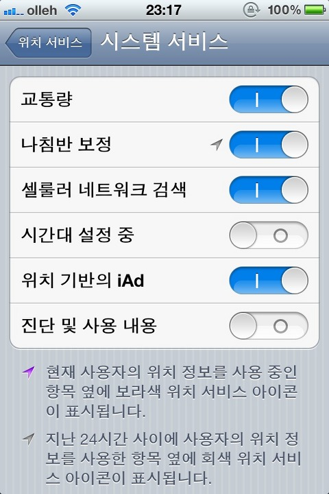

지난 주 제가 날린 트윗들 중 리트윗 받은 글들만.

<!-- truncate -->

<blockquote>
2011-10-30

14개; RT @sungchi: 전 10개 맞았어요;; RT @xguru HTML5 기본에 대해 얼마나 아는지 테스트해보는 퀴즈[j.mp/taTXqm](https://t.co/pLArJfN2) 총 18문제인데.. 2개 틀렸네요 ㅠㅠ

 = HTML5에 관심있는 분들은 테스트 고고씽;
</blockquote>

* * *

<blockquote>
2011-10-30
(아이폰 팁) 확실히 "시간대 설정 중"을 끄니 배터리가 오래가는 것 같다. 설정 - 위치 서비스 - 시스템 서비스 들어가서 끄면 됨[twitpic.com/788v4g ](https://t.co/brtXAnAq)

 = 약간이지만 확실히 나아졌다는 느낌이 듭니다.
</blockquote>

* * *

<blockquote>
2011-10-30

진사마가 나꼼수에 대해 "야담과 실화. 저열하고 비열한 공격. 언젠가 똑같이 당할 겁니다." 라고 했다는데 100% 동감하면서도 난 진사마가 대구의 밤문화 어쩌고 하는 식으로 깐죽거리는 것도 좋아하는데;

= 한 쪽에서 저열하고 비열하게 하지 않는다고 다른 쪽에서도 비열하지 않게 하지 않으리란 보장이 없다는 게 함정?
</blockquote>

* * *

<blockquote>
2011-10-30

응? 구글이 다음을 인수할 지도 모른다는 루머? [economy.hankooki.com/lpage/industry...](https://t.co/x1zlpAFS)
= 구글이 다음을 노렸다는 것도 놀랍지만, SKT가 다음을 노리고 있다는 것도 놀랍다.
</blockquote>

* * *

<blockquote>
**2011-10-28**

**정말 요즘 정동영을 보면 예전의 그 정동영이 맞나 싶다. 과거가 어쨌든 지금은 민주당에서 제일 나은 듯.**

 = 정말 놀라울 뿐. ㄷㄷㄷ 지금의 정동영이라면 그의 유일한 단점이 민주당 소속이라는 것일 뿐일 정도다. 놀랍지 않은가.
</blockquote>

* * *

<blockquote>
2011-10-28

(유튜브) 휘어지는 스마트폰, 새로운 인터페이스 (비틀기), 노키아 키네틱 디바이스 [youtube.com/watch?v=b4jKWT...](https://t.co/QT2WFFx7) 역시 노키아!

<iframe width="100%" height="315" src="https://www.youtube.com/embed/sSUJepHJ_ZQ?si=aidO-RP-bZFRu43w" title="YouTube video player" frameborder="0" allow="accelerometer; autoplay; clipboard-write; encrypted-media; gyroscope; picture-in-picture; web-share" referrerpolicy="strict-origin-when-cross-origin" allowfullscreen></iframe>
</blockquote>

* * *

<blockquote>
2011-10-24

안철수연구소 오늘 상한가. 벌써 주당 10만원. 확실히 이건 비정상이다.

 = 주식이 무슨 like 버튼도 아니고, 아고라 서명도 아니고... 관계자가 뉴스에 오르내리면 주가가 오르는 건 도대체 뭘까?
</blockquote>