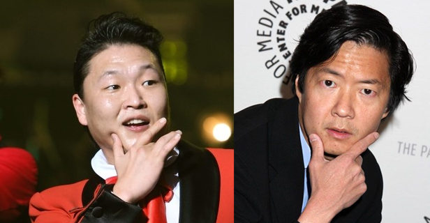

싸이의 강남스타일이 드디어 유튜브 1억뷰를 돌파했다.

조회수는 지수함수를 따라가고 있다. 점점 가속도가 붙는 형국.

*싸이, 강남스타일 조회수 그래프*

참고로 현재 4억7천뷰를 기록하고 있는 LMFAO의 Party Rock Anthem 의 조회수 그래프는 아래와 같다.

*이건 LMFAO의 Party Rock Anthem 조회수 그래프*

그러다 오늘 문득 켄 정 (Ken Jeong)이 싸이와 닮았다는 생각이 들었다. 고등학교를 조기 졸업하고 듀크대 의대까지 나와 의사를 하다가 헐리우드의 코미디 배우가 된 그 사람.

*왼쪽은 싸이, 오른쪽은 켄 정. 닮았나?*

위의 사진은 켄 정이 좀 늙어보이게 나왔지만 사실 영화나 드라마에서는 조금 더 젊게 나온다. 짤막하고 통통한 이미지, 잘 생긴 아시아계 훈남이 아니라 코믹 액션영화 속 주인공의 사이드 킥 같은 분위기.

싸이가 예전에 오디션 프로그램에서 통통하고 웃기게 생긴 사람들이 나오면 항상 자기 노래를 부른다고 했었던 것처럼, 뭔가 저런 외모의 동양인에게 기대하는 스테레오 타입 같은 것이 있는 건가?