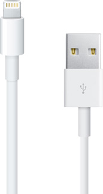
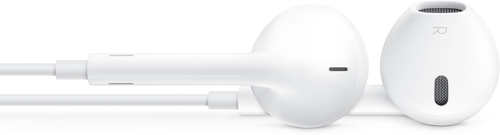
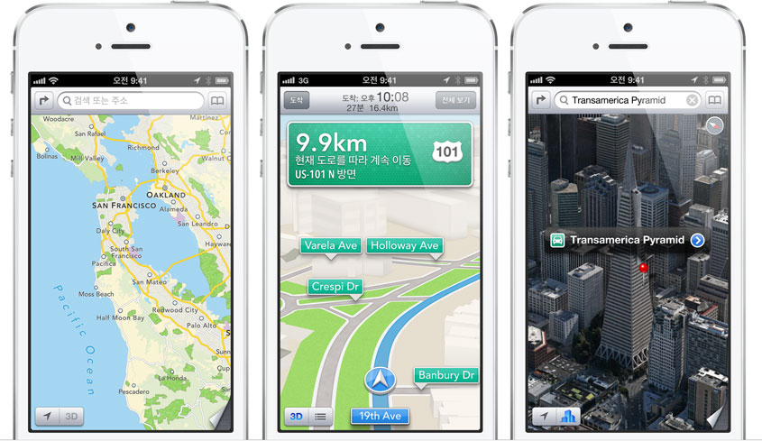

아직 국내에서 아이폰5를 판매하지는 않지만, 해외는 이미 핸즈온 비디오와 리뷰들이 올라오고 있다.

이미 수많은 리뷰들이 있기 때문에 굳이 거기에 더 보태서 이미 나와있는 이야기를 할 필요는 없을 것 같고, 아직 아이폰5를 만져보지는 않았지만 아이폰5에 대한 생각 몇 가지를 적어본다.

<!-- truncate -->

*작지만 큰 차이. 아이폰5*

**첫째, 섬세한 외관 (요즘 한국 언론식이라면 명품 외관이라는 표현도 가능할 듯)**

요즘 같은 시대에는 2년에 한번씩 핸드폰을 바꾸는 것이 크게 이상한 일이 아니다. 단말기 가격을 최대 100만원 잡고 한달에 4만1천원 정도 (100만원 / 24개월 ≒ 4만1,600원)를 내면서 스마트폰을 사용하는 시대라는 뜻이다. 물론 이통사/제조사의 단말기 보조금을 받고, 나중에 이를 중고로 다시 파는 비용을 생각하면 이보다는 훨씬 저렴해지기는 한다.

어쩄든 이렇게 누구나(...) 하지만 매우 비싸게(...) 스마트폰을 사용할 수 있는 시대에 애플은 마치 스위스산 고급 시계와 같은 표현들 - 장인이 만든 시계 (a finely craft watch), 크리스탈 다이아몬드로 비스듬하게 마감한 모서리를 느껴보세요. (A crystalline diamond cuts this beveled edge.) - 을 사용하고 있다. 심지어 뒷면은 몇백만원하는 노트북에 쓰이는 재질과 같다는 표현까지 하고 있다.

불과 몇 년 전만 해도 우리나라에 팔리던 핸드폰들은 기능은 꽝이지만 디자인은 나름 멋진 폰들이 있었고, 그 중의 대표적인 것이 바로 LG전자의 프라다폰이었다. (그리고 삼성은 이 때도 역시 이 성공을 따라해 아르마니폰을 내놓았다.)

다이아몬드를 사용해 정밀하게 외형을 깍는 아이폰5 프로모션 비디오는 (수준은 좀 다르지만) 마치 몇몇 엄청나게 비싼 고가의 시계의 프로모션 비디오를 떠올리게 한다.

<iframe width="100%" height="315" src="https://www.youtube-nocookie.com/embed/rlcizTLksdo?si=-b9Py78qcfjur7Gz" title="YouTube video player" frameborder="0" allow="accelerometer; autoplay; clipboard-write; encrypted-media; gyroscope; picture-in-picture; web-share" referrerpolicy="strict-origin-when-cross-origin" allowfullscreen></iframe>*이 시계, 한화로 3억이 넘는다고 한다*

안드로이드가 아직 쫒아오지 못한 소프트웨어보다 외형에 신경을 쓴 것이라 생각한다. 현재 안드로이드 폰들은 플라스틱 케이스가 대부분이고 이런 디테일은 대부분 없다. 즉, 허를 찔렀다고 봐도 좋을 듯 하다. 이로써 앞으로 한동안 고급 외형에 대한 이슈에서도 애플이 먼저 한발 담궜다고 볼 수 있지 않을까. 다이아몬드로 깎은 외형. 몇백만원짜리 제품(노트북)에 쓰이는 것과 같은 재질, 티는 잘 안나지만 본인은 알아보는 그 말끔함과 그로 인한 허세.

**둘째, 앞뒷면을 가리지 않는 커넥터 - 라이트닝**

기존의 30핀 커넥터를 버리고 새로운 커넥터를 사용한다고 욕을 많이 먹고 있지만, 사실 이것은 필연적이다. 애플이 기존의 아이폰에서 레티나 디스플레이를 채용하고, 이번에 다시 16:9 의 화면을 채용하는 것만큼이나 언젠가는 해야할 일이다.

애플의 초슬림 노트북인 맥북에어 시리즈를 보다보면 맥북에어의 가장 두꺼운 부분이 USB 커넥터 때문인 것과 같은 느낌을 받을 때가 있다. 즉, 기술이 발전하다 보면 언젠가는 새로운 기술이 도입될 필요가 있다는 것이다.

기존의 아이폰, 아이팟, 아이패드 사용자들에게는 기존의 30핀을 사용할 수 없게 되니 원성을 많이 들을 수 있으나 결국은 큰 문제가 되지 않을 뿐더러 편리하다는 느낌을 줄 수 있을 것 같다. 앞뒷면을 가리지 않기 때문이다. 기존의 각종 커넥터들 중에 앞뒷면을 가리지 않는 커넥터가 있었던가? 우리나라의 접지가 없는 220V 전원 어뎁터를 제외하고는 본 적이 없는 듯 하다.

우리는 USB 커넥터를 꼽을 때도, 한국 핸드폰 표준 24핀 커넥터, 20핀 커넥터 등등 모두 앞뒷면을 가리기 때문에 꼽기 전에 반드시 한번 살펴본다. 하지만 이어폰 줄을 이어폰 구멍에 꼽을 때 우리는 잘 살펴보지 않는다. 그런 작은 차이. 하지만 상당히 편할 듯 싶다.

(이 라이트닝 커넥터로 비디오 출력이 안된다느니 하는 건 역시 차기 혹은 차차기에 구현될 듯. 불완전하지만 멋진 컨셉을 내놓고 조금씩 완성해가는 애플의 기존 작태로 보아.)

셋째, 새로운 디자인의 이어폰 - 이어팟 (이어포드)

이건 실제 착용해보기 전까지는 알 수 없으나 이미 나와있는 스펙을 보자면 상당히 음원을 외곡하지 않고 최대한 원래 그대로 들려준다고 한다. 원래 초창기 아이팟 때부터 애플의 디지털 음원 재생능력은 뛰어났다. 그래서 많은 뮤지션들이 아이팟을 썼기도 했고. (음악에 대한 감각은 취향이지만, 뮤지션들의 원래 의도를 생각한다면 무조건 저음이 강조되거나 고음이 선명하거나 하는 게 좋은 건 아닐 수 있다.)

그리고, 귀가 작거나 귀의 모양이 특이해서 평범한 오픈형 이어폰을 절대 사용하지 못하고, 커널형만 사용하는 사람들이 적지 않은데, 이번에 새로 나온 이어폰인 이어팟은 여러 사람들의 귀로 테스트를 해서 잘 빠지지 않는 제품을 만들었다고 한다.

**넷째, 구글 제품들을 빼는 건 좀 성급했다.**

이건 엄밀히 말하면 아이폰5의 문제가 아니라 iOS6 의 문제이긴 하지만, 어쨌든 아이폰5가 iOS6를 탑제하고 나오는 첫번째 제품이니까.

개인적으로 유튜브 앱을 켜서 이거저것 둘러보는 편은 아닐 뿐더러, 유튜브는 모바일웹도 잘 만들어서 유튜브 앱이 빠지는 건 전혀 문제가 아니다.

그런데, 지도 앱이 구글맵을 채용하지 않고 애플의 것으로 바뀐 것은 아직 시기상조라는 생각이 크다. 특히 미국을 제외한 다른 나라에서의 상태는 심각한 수준. 원래 기본 지도 앱을 주로 사용했는데 한동안은 다음 지도나 네이버 지도 사용이 필수일 듯 하다. 애플과 구글 싸움에 괜히 소비자들이 피해를 보는 느낌. (만약 잡스가 살아있더라면 이번까지는 구글맵을 쓰지 않았을까 생각도 해본다)

게다가 구글은 자체 유튜브 앱은 앱스토어에 올려놨는데, 지도앱을 아직도 등록을 하지 않고 있다. 아무래도 천천히 내는 것이 아닐까? 애플 아이폰의 지도 앱의 허접한 수준을 더 알리기 위해 최대한 시간을 끌며 천천히 낼 것 같은 생각이 든다.

**그리고.**

나는 SKT를 선택할지, KT를 선택할지 고민 중이다. 이 놈의 독과점 통신 시장, 맘에 드는 곳은 없는데 선택은 해야만 하는 현실. -.-